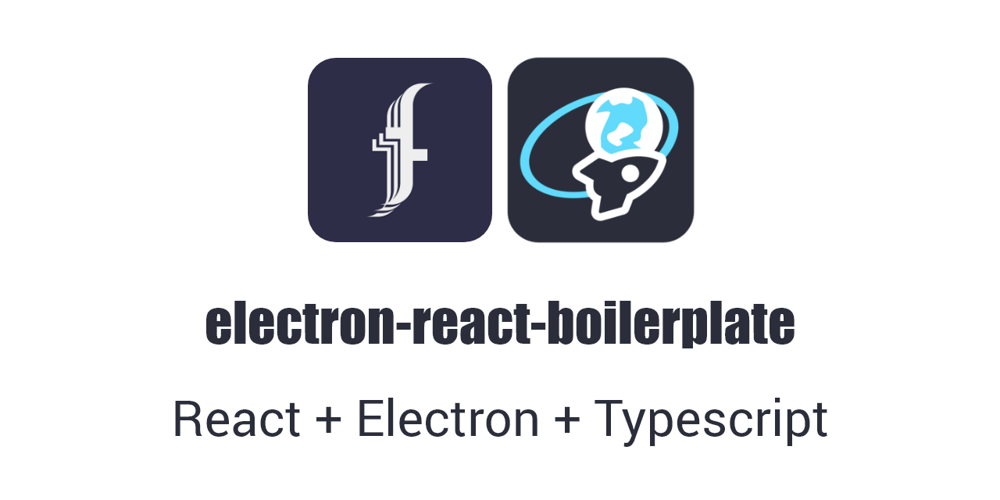

<p></p>

# Another Electron React Boilerplate with Typescript Support

[](https://github.com/fliegwerk/electron-react-boilerplate/actions?query=workflow%3ACI)
[](https://github.com/fliegwerk/electron-react-boilerplate)


[](https://github.com/fliegwerk/electron-react-boilerplate)

A boilerplate to develop an electron application with react in a simple manner

## Introduction

This project integrates a React application in an Electron container
with build and package support written in Typescript.\
A minimal set of dependencies allows for easy updates and maintenance.\
It is set up and written as simple as possible
so everyone can understand and configure the boilerplate code for their needs.

## Getting Started

First, create a new repository from the GitHub web interface
or clone the project and manually integrate the changes into your own project.

After you have initialized the project, install the development dependencies with:

```
npm ci
```

## Available Scripts

In the project directory, you can run:

### `npm start`

Runs the app in the development mode.\
Compiles the main process script and starts the react-scripts development server.\
After the first compilation, it opens an electron window with the rendered content.

The page will reload if you make edits.\
You will also see any lint errors in the console.

### `npm test`

Launches the test runner in the interactive watch mode.\
See the section about [running tests](https://facebook.github.io/create-react-app/docs/running-tests) for more information.

### `npm run build`

Builds the app for production to the `build` folder.\
It correctly bundles React in production mode and optimizes the build for the best performance.\
Additionally, it builds the "main" electron process scripts next to the webpage build.

The build is minified, and the filenames include the hashes.

### `npm run package`

Builds the app described in the `npm run build` step and creates packages for different operating systems.

If you want to package for only one operating system, call:

```
npm run package:linux  # for linux operating systems
npm run package:win    # for windows operating systems
npm run package:mac    # for macOS operating systems
```

Look at the `build` property in the `package.json` if you want to configure the packaging process.\
The script calls the [electron-builder](https://www.electron.build/), which reads this property from the `package.json`.

To configure electron-builder, take a look at their [documentation](https://www.electron.build/configuration/configuration).

### `npm run style`

Styles and formats all project files with the defined code style.

It uses [Prettier](https://prettier.io/), an opportunistic code formatter, configured via the `.prettierrc.js` file.

Please also take a look at the `.editorconfig`, which defines the default formatting in your editor.\
For more information, take a look at their [landing page](https://editorconfig.org/).

### `npm run lint`

Checks the syntax of the sourcecode with [ESLint](https://eslint.org/).

ESLint can be configured through the property `eslintConfig` in the `package.json`.

## Adding dependencies

Add dependencies is a simple task.\
If you need the dependency only on the React app, install it as a development dependency:

```
npm install --save-dev new-renderer-dep
```

If you need the dependency also in the process scripts, install it as a normal project dependency:

```
npm install new-main-dep
```

This is needed because electron-builder will bundle all normal project dependencies
next to the packaged application's `build` folder.
The react-scripts builder integrates all imported dependencies directly into the `build` folder.

## Publishing

When you want to create a new release, follow these steps:

1. Bump the version in the `package.json` `version` field based on the changes (for example, from `1.1.2` to `1.2.0`)
2. Commit this change:
   ```
   git commit -am "Bump package version (v1.2.0)"
   ```
3. Tag the created commit:
   ```
   git tag v1.2.0
   ```
   Make sure the tag name's format follows the structure `vX.X.X`. (because the release workflow will detect the git tag)
4. Push the change and the git tag to the GitHub repository:
   ```
   git push && git push --tag
   ```

## Further information

The boilerplate has a [Wiki](https://github.com/fliegwerk/electron-react-boilerplate/wiki)
which describes toolchains, commands and recipes more in-depth.

If you have any questions,
please first take a look at the [FAQ](https://github.com/fliegwerk/electron-react-boilerplate/wiki/FAQ).

To learn React, check out the [React documentation](https://reactjs.org/).

## Project structure

```yaml
root:
  - .github    # github related files like workflows, issue templates, configurations, ...
  - build      # the build output of react-script builder and the main process script
  - images     # images and branding for the project
  - main       # here is the source code for the main process scripts
    with:
      - electron.ts  # main process script file - here you can configure the behavior of electron
  - public     # template files, which will be copied to the build folder on the build step
  - release    # here are the executables of the package step placed
  - resources  # resource files like icons, logos, configuration files for the electron-builder
  - src        # the development root the React app
    with:
      - assets      # non-source files like multimedia, binary blobs, compiled parts, ...
      - components  # React components
      - hooks       # React hooks
      - lib         # generic libraries like converters, connectors, or utility functions
      - model       # global Typescript definitions used in the project (you can also access these types in the main process scripts)
      - index.tsx   # the root of the React app
  - .editorconfig        # style and format definitions for your IDE or code editor
  - .prettieringore      # defines which files prettier does not change (like a .gitignore for git repos)
  - .prettierrc.js       # style and format definitions for prettier
  - package.json         # main project information source - here are all project-related things defined (like name, dependencies, build, ...)
  - package-lock.json    # detailed information about the installed dependencies and their relation to each other
  - tsconfig.json        # the Typescript configuration file for the React app and their builder
  - tsconfig.main.json   # the Typescript configuration file for the build of main process scripts of electron
  - webpack.main.js      # the configuration file for webpack compiling the main electron process script
  - webpack.preload.js   # the configuration file for webpack compiling the preload script for browser windows
```
